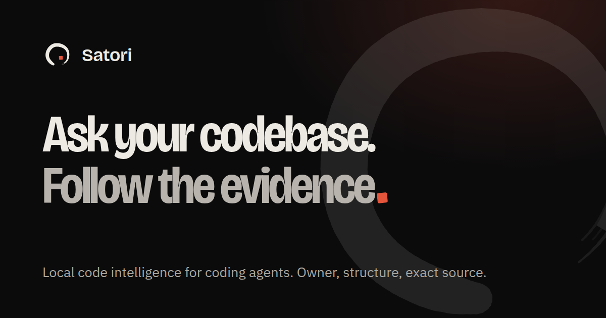

<p align="center">
  <a href="https://satori.hamza.my.id"></a>
</p>

<h1 align="center">Satori</h1>

<h3 align="center">Semantic code search for coding agents.</h3>

<p align="center">
  Ask where behavior lives in plain English. Satori finds the owning code and hands your agent the exact source, locally, through MCP.
</p>

<p align="center">
  <a href="https://satori.hamza.my.id"><strong>Website</strong></a> &nbsp;·&nbsp;
  <a href="#start"><strong>Get started</strong></a> &nbsp;·&nbsp;
  <a href="https://satori.hamza.my.id/docs/"><strong>Docs</strong></a> &nbsp;·&nbsp;
  <a href="https://satori.hamza.my.id/architecture"><strong>Architecture</strong></a> &nbsp;·&nbsp;
  <a href="docs/REFERENCE.md"><strong>Full reference</strong></a>
</p>

<p align="center">
  <a href="https://www.npmjs.com/package/@satori-code/cli"></a>
  <a href="https://github.com/ham-zax/satori/actions/workflows/ci.yml"></a>
  <a href="LICENSE"></a>
  
  
</p>

<p align="center">
  <a href="https://satori.hamza.my.id"></a>
</p>

<a id="start"></a>

## Start

Needs Node.js 22.13+ on Linux x64 or WSL2.

```bash
npx -y @satori-code/cli@latest install
npx -y @satori-code/cli@latest doctor
```

`install` sets up Codex, Claude Code, and OpenCode (Antigravity with `--client agy`). Restart your agent and say:

```text
Index /absolute/path/to/repo with Satori, then find where auth refresh is handled.
```

That's it. No account, no API key.

Or let your agent do the setup. Paste this:

```text
Install Satori by following the "For AI agents" section of
https://github.com/ham-zax/satori, then index this repository.
```

## For AI agents

If you are a coding agent setting up or using Satori, follow these steps.

**Install**

1. Check the platform: `node -v` must be 22.13 or newer, on Linux x64 or WSL2. Native Windows and macOS are not supported; on Windows, run inside WSL2.
2. Run `npx -y @satori-code/cli@latest install`, then `npx -y @satori-code/cli@latest doctor`.
3. If install reports no supported client, rerun it with `--client codex`, `claude`, `opencode`, `agy`, or `all`.
4. Tell the user to restart you. The Satori MCP tools load only at agent startup.

**Use**

1. Call `list_codebases`. If the repository is not indexed, call `manage_index` with `action="create"` and the repository's absolute `path`. Indexing runs in the background; check it with `action="status"`.
2. Start every "where is…", "what owns…", or "what calls…" question with `search_codebase`.
3. Follow `recommendedNextAction` when it is returned. Use `file_outline` to pick a symbol, and `call_graph` or `trace_path` for relationships.
4. Read the exact code with `read_file` before you claim anything or edit.
5. After editing files, call `manage_index` with `action="sync"` when you need fresh results.

**Rules**

- Every `path` is absolute.
- Treat `call_graph` results as leads to verify, not complete proof.
- Satori is read-only. Make source edits with your own tools.
- The installer also ships a `satori` skill (`~/.agents/skills/satori`) with the full workflow.

## How it works

You ask a question. Your agent follows the evidence:

```text
search_codebase  →  owner  →  file_outline / call_graph  →  read_file
  by meaning         the         structure and              exact source
  and exact text     symbol      supported relationships    to verify
```

Satori combines embeddings with BM25 and exact matches, maps hits to the symbols that own them, and keeps every answer on one indexed snapshot of the repository. Edits sync incrementally, and every answer says whether its evidence is still current.

<details>
<summary><strong>The 11 MCP tools</strong></summary>

| Tool | What it does |
|---|---|
| `manage_index` | Create, sync, inspect, cancel, reindex, or clear the index. |
| `search_codebase` | Find behavior by meaning and exact evidence. Start here. |
| `architecture_overview` | Summarize areas, boundaries, and hotspots. |
| `continue_search` | Page through a result set without searching again. |
| `file_outline` | List the symbols and spans in one file. |
| `call_graph` | Callers, callees, imports, and exports where supported. |
| `trace_path` | Shortest relationship path between two symbols. |
| `find_references` | Exact textual occurrences of one symbol. |
| `detect_changes` | Map a Git diff to affected symbols and callers. |
| `read_file` | Read one symbol or a bounded source span. |
| `list_codebases` | List indexed repositories and their readiness. |

</details>

## Why use it

- **Unfamiliar code.** Ask where behavior lives before you know a filename.
- **Bugs.** Go from an error string to the code that owns it.
- **Refactors.** See the owner, its structure, and its callers before the first edit.
- **Less context waste.** Your agent reads symbol-sized evidence, not whole files. Smaller local models benefit most.
- **Many agents, one index.** Local sessions share one runtime.

## Free, local, read-only

- Free and open source under AGPL-3.0. No account and no telemetry upload.
- The default stack runs offline after install: Potion embeddings, BM25, LateOn reranking, and LanceDB.
- Satori never edits your source and adds nothing to `AGENTS.md` or hooks.
- `satori uninstall` removes client config; `--purge` also deletes `~/.satori`.
- Connected Voyage and Milvus/Zilliz, or local Ollama, are optional. See the [reference](docs/REFERENCE.md#runtime-choices).

## Benchmarks

**The offline stack.** [Potion](https://huggingface.co/minishlab/potion-code-16M-v2) is a 16M-parameter static code embedding, fast enough to embed a whole repository on a laptop CPU. BM25 and exact matching catch the identifiers it misses. [LateOn](https://huggingface.co/lightonai/LateOn-Code-edge) is a 17M-parameter late-interaction code model. It is too costly to run over everything, so Satori uses it only to rerank the top 32 candidates, together with each candidate's role, callers, callees, and tests.

**What reranking adds.** 36 owner-finding tasks across 6 repositories, where "owner at 1" means the right symbol comes first:

| Stack | Owner at 1 | Owner at 3 | MRR |
|---|---:|---:|---:|
| Potion + BM25 + exact | 0.19 | 0.36 | 0.29 |
| + LateOn reranking (depth 32) | **0.39** | **0.64** | **0.50** |

Tuning-set results, measured on an earlier prompt projection; the held-out run is still pending. [Evidence and limits](docs/evidence/lateon-quality-20260804/).

**Against [codebase-memory-mcp](https://github.com/DeusData/codebase-memory-mcp) 0.11.0.** Same machine, 5 public repositories; each range spans two runs:

| Repository | Index | Symbol lookup p50 | Callers p50 | One-file edit |
|---|---:|---:|---:|---:|
| ripgrep (Rust) | 9 s vs 3–5 s | 14–16 vs 13 ms | 141–147 vs 12 ms | 2.2 s vs 2.1–2.6 s |
| trufflehog (Go) | 67–71 s vs 9–10 s | 59–65 vs 19 ms | 64–69 vs 16 ms | 15–16 s vs 23–27 s |
| satori (TypeScript) | 76–77 s vs 20 s | 39–50 vs 31 ms | 46–61 vs 21 ms | 20–27 s vs 13 s |

Satori is first in each pair. codebase-memory-mcp builds only a graph, so it indexes and answers caller queries faster. Satori also builds embeddings, which is what lets it answer plain-English "where is this behavior" questions that a graph cannot. [All 5 repositories and the raw results](docs/REFERENCE.md#satori-versus-codebase-memory-mcp).

## Languages

Call graphs for TypeScript, JavaScript, Python, Go, Java, C#, C++, Rust, Scala, Kotlin, and PHP. Symbols and outlines for 88 more languages. Semantic search across about 140. [Details](docs/REFERENCE.md#language-support).

## Commands

| Command | Does |
|---|---|
| `satori install` | Install the runtime and configure your agents. |
| `satori doctor` | Check the installation. |
| `satori upgrade` | Upgrade to the latest verified release. |
| `satori terminate` | Stop running Satori servers. |
| `satori uninstall` | Remove client config (`--purge` removes everything). |

Without a global install, prefix commands with `npx -y @satori-code/cli@latest`.

## Learn more

- [Docs](https://satori.hamza.my.id/docs/): setup, tools, and troubleshooting.
- [Full reference](docs/REFERENCE.md): runtimes, configuration, index profiles, benchmarks.
- [Product guide](docs/PRODUCT_GUIDE.md): how to get the most out of Satori.

## Development

```bash
pnpm install
pnpm build
pnpm run check
```

See [CONTRIBUTING.md](CONTRIBUTING.md), [SECURITY.md](SECURITY.md), and [docs/RELEASING.md](docs/RELEASING.md).

## License

[AGPL-3.0-only](LICENSE). Commercial licensing is available: see [COMMERCIAL-LICENSING.md](COMMERCIAL-LICENSING.md).

Copyright (c) 2026 Hamza ([@ham-zax](https://github.com/ham-zax)).
